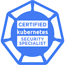
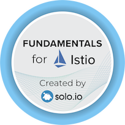

<!--
**krishnakv/krishnakv** is a ✨ _special_ ✨ repository because its `README.md` (this file) appears on your GitHub profile.

Here are some ideas to get you started:

- 🔭 I’m currently working on ...
- 🌱 I’m currently learning ...
- 👯 I’m looking to collaborate on ...
- 🤔 I’m looking for help with ...
- 💬 Ask me about ...
- 📫 How to reach me: ...
- 😄 Pronouns: ...
- ⚡ Fun fact: ...
-->

## Hi There, Krishna here. Welcome to my open source dashboard.

- Currently working on CNCF projects
- Looking to collaborate on driving open source contributions at an org level
- Ask me about SPIFFE/ Spire

### Github Stats

### Languages

 

### Certs

 

<a href="https://google.accredible.com/6d8e197b-2b17-4eac-b730-1c3ac4e26f20">"

</a>
<a href="https://google.accredible.com/56c56c0a-b1c0-48b2-8153-02b0b206b100">"

</a>
<a href="https://google.accredible.com/4406a400-119a-4174-b95b-16d9216ad7f8">"

</a>

